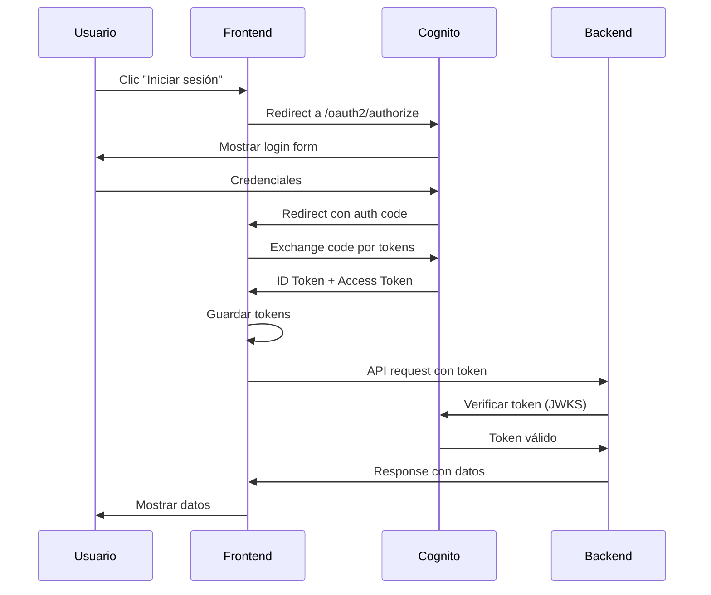

# 🔐 Guía de Configuración AWS Cognito

## 📋 Resumen

Esta guía te ayudará a configurar AWS Cognito para autenticación OAuth2/OIDC en tu aplicación.

## 🎯 Paso 1: Crear User Pool en Cognito

### 1.1 Acceder a AWS Console

1. Ir a: https://console.aws.amazon.com/cognito
2. Selecciona región: **us-east-1** (o tu región preferida)
3. Clic en **"Create user pool"**

### 1.2 Configurar Sign-in Experience

**Step 1: Configure sign-in experience**

- ✅ **Cognito user pool**
- **Sign-in options**: 
  - ✅ Email
  - ✅ Username (opcional)
- **User name requirements**: Case insensitive
- Clic en **Next**

### 1.3 Configurar Seguridad

**Step 2: Configure security requirements**

- **Password policy**: 
  - Minimum length: 8
  - ✅ Require lowercase letters
  - ✅ Require uppercase letters
  - ✅ Require numbers
  - ✅ Require special characters

- **Multi-factor authentication**: 
  - ⚪ No MFA (para desarrollo)
  - O ✅ Optional MFA

- **User account recovery**: 
  - ✅ Enable self-service account recovery
  - Recovery method: Email only

- Clic en **Next**

### 1.4 Configurar Sign-up Experience

**Step 3: Configure sign-up experience**

- **Self-registration**: ✅ Enable self-registration
- **Attribute verification**: ✅ Email

- **Required attributes**:
  - ✅ email
  - ✅ name

- Clic en **Next**

### 1.5 Configurar Mensajes

**Step 4: Configure message delivery**

- **Email provider**: 
  - ⚪ Send email with Cognito (para desarrollo - 50 emails/día)
  - O ✅ Send email with Amazon SES (para producción)

- **FROM email address**: no-reply@verificationemail.com (default)
- **REPLY-TO email address**: (opcional)

- Clic en **Next**

### 1.6 Integrar tu App

**Step 5: Integrate your app**

- **User pool name**: `mini-udemy-users`
- **App type**: ✅ Public client
- **App client name**: `mini-udemy-web-client`

- **Authentication flows**:
  - ✅ ALLOW_USER_PASSWORD_AUTH
  - ✅ ALLOW_REFRESH_TOKEN_AUTH
  - ✅ ALLOW_CUSTOM_AUTH (opcional)

- **OAuth 2.0 grant types**:
  - ✅ Authorization code grant
  - ✅ Implicit grant (para testing)

- **OpenID Connect scopes**:
  - ✅ Email
  - ✅ OpenID
  - ✅ Profile

- **Callback URLs**: 
  ```
  http://localhost:5173
  http://localhost:5173/callback
  ```

- **Sign out URLs**: 
  ```
  http://localhost:5173
  http://localhost:5173/logout
  ```

- **Advanced app client settings**:
  - Token expiration: ID token (1 hora), Access token (1 hora), Refresh token (30 días)

- Clic en **Next**

### 1.7 Revisar y Crear

**Step 6: Review and create**

- Revisa toda la configuración
- Clic en **Create user pool**

## 🔑 Paso 2: Obtener Credenciales

### 2.1 User Pool ID

1. En la consola de Cognito, clic en tu User Pool
2. En la pestaña **"User pool overview"**
3. Copia el **User pool ID** (formato: `us-east-1_XXXXXXXXX`)

### 2.2 App Client ID

1. En tu User Pool, ir a la pestaña **"App integration"**
2. En la sección **"App client list"**, clic en tu app client
3. Copia el **Client ID** (formato: `1234567890abcdefghijklmnop`)

### 2.3 Cognito Domain

1. En la pestaña **"App integration"**
2. Sección **"Domain"** → Clic en **"Actions"** → **"Create Cognito domain"**
3. **Domain prefix**: `mini-udemy-app` (debe ser único)
4. Verifica disponibilidad
5. Clic en **Create**
6. Tu dominio será: `https://mini-udemy-app.auth.us-east-1.amazoncognito.com`

## ⚙️ Paso 3: Configurar Variables de Entorno

### Backend (.env)

```env
# Cognito
COGNITO_USER_POOL_ID=us-east-1_XXXXXXXXX
COGNITO_CLIENT_ID=1234567890abcdefghijklmnop
COGNITO_DOMAIN=https://mini-udemy-app.auth.us-east-1.amazoncognito.com
```

### Frontend (.env)

```env
VITE_API_URL=http://localhost:3000/api

# AWS Cognito Configuration
VITE_COGNITO_DOMAIN=https://mini-udemy-app.auth.us-east-1.amazoncognito.com
VITE_COGNITO_CLIENT_ID=1234567890abcdefghijklmnop
VITE_COGNITO_REDIRECT_URI=http://localhost:5173
VITE_COGNITO_LOGOUT_URI=http://localhost:5173
```

## 📦 Paso 4: Instalar Dependencias

```bash
cd frontend
npm install react-oidc-context
```

## 🔌 Paso 5: Configurar la Aplicación

### 5.1 Actualizar main.jsx

```jsx
import React from 'react';
import ReactDOM from 'react-dom/client';
import { BrowserRouter } from 'react-router-dom';
import { AuthProvider } from 'react-oidc-context';
import { cognitoConfig } from './config/cognito';
import App from './App';
import './index.css';

ReactDOM.createRoot(document.getElementById('root')).render(
  <React.StrictMode>
    <BrowserRouter>
      <AuthProvider {...cognitoConfig}>
        <App />
      </AuthProvider>
    </BrowserRouter>
  </React.StrictMode>
);
```

### 5.2 Actualizar App.jsx

```jsx
import { Routes, Route } from 'react-router-dom';
import { CognitoAuthProvider } from './context/CognitoAuthContext';
import CognitoLogin from './components/auth/CognitoLogin';
import Home from './pages/Home';
// ... otros imports

function App() {
  return (
    <CognitoAuthProvider>
      <Routes>
        <Route path="/cognito-login" element={<CognitoLogin />} />
        <Route path="/" element={<Home />} />
        {/* ... otras rutas */}
      </Routes>
    </CognitoAuthProvider>
  );
}

export default App;
```

## 🧪 Paso 6: Probar la Integración

### 6.1 Iniciar Aplicación

```bash
# Terminal 1 - Backend
cd backend
npm start

# Terminal 2 - Frontend
cd frontend
npm run dev
```

### 6.2 Acceder a Login

1. Abrir navegador: http://localhost:5173/cognito-login
2. Clic en **"Iniciar sesión con Cognito"**
3. Serás redirigido a la página de Cognito
4. Clic en **"Sign up"** para crear cuenta

### 6.3 Crear Usuario de Prueba

1. Email: `test@example.com`
2. Contraseña: `Test123!@#`
3. Confirmar email (revisa tu correo)
4. Iniciar sesión

### 6.4 Verificar Tokens

Una vez autenticado, deberías ver:
- ✅ Nombre de usuario
- ✅ Email
- ✅ ID Token (JWT)
- ✅ Access Token
- ✅ Botón de "Cerrar sesión"

## 🔐 Paso 7: Usar Tokens en API

### 7.1 Actualizar Axios Interceptor

```javascript
// frontend/src/services/api.js
import { useAuth } from 'react-oidc-context';

// Interceptor para añadir token
api.interceptors.request.use(
  (config) => {
    // Intenta usar token de Cognito primero
    const cognitoToken = localStorage.getItem('cognito_id_token');
    if (cognitoToken) {
      config.headers.Authorization = `Bearer ${cognitoToken}`;
    } else {
      // Fallback a JWT local
      const token = localStorage.getItem('token');
      if (token) {
        config.headers.Authorization = `Bearer ${token}`;
      }
    }
    return config;
  },
  (error) => Promise.reject(error)
);
```

### 7.2 Validar Tokens en Backend

```javascript
// backend/src/middleware/cognitoAuth.js
const jwt = require('jsonwebtoken');
const jwksClient = require('jwks-rsa');

const client = jwksClient({
  jwksUri: `https://cognito-idp.${process.env.AWS_REGION}.amazonaws.com/${process.env.COGNITO_USER_POOL_ID}/.well-known/jwks.json`
});

function getKey(header, callback) {
  client.getSigningKey(header.kid, (err, key) => {
    const signingKey = key.publicKey || key.rsaPublicKey;
    callback(null, signingKey);
  });
}

const verifyCognitoToken = (req, res, next) => {
  const token = req.headers.authorization?.split(' ')[1];
  
  if (!token) {
    return res.status(401).json({ error: 'No token provided' });
  }

  jwt.verify(token, getKey, {
    audience: process.env.COGNITO_CLIENT_ID,
    issuer: `https://cognito-idp.${process.env.AWS_REGION}.amazonaws.com/${process.env.COGNITO_USER_POOL_ID}`,
    algorithms: ['RS256']
  }, (err, decoded) => {
    if (err) {
      return res.status(401).json({ error: 'Invalid token' });
    }

    req.user = {
      userId: decoded.sub,
      email: decoded.email,
      name: decoded.name
    };
    next();
  });
};

module.exports = { verifyCognitoToken };
```

## 🔄 Flujo de Autenticación



## 🎨 Personalizar Hosted UI

### 8.1 Agregar Logo

1. En Cognito → User Pool → **App integration**
2. Sección **"Hosted UI customization"**
3. Subir logo (400x400 px, PNG)
4. CSS personalizado:

```css
.banner-customizable {
  background-color: #5624d0;
}

.submitButton-customizable {
  background-color: #5624d0;
}

.submitButton-customizable:hover {
  background-color: #401b9c;
}
```

## 💰 Costos

### Cognito Free Tier (12 meses)
- ✅ 50,000 MAUs (Monthly Active Users)
- ✅ Autenticación básica
- ✅ MFA opcional

### Después del Free Tier
- Primeros 50,000 MAUs: **Gratis**
- 50,001 - 100,000 MAUs: $0.0055/MAU
- Más de 100,000: Precio decreciente

**Para desarrollo**: ✅ Completamente gratis

## 🐛 Solución de Problemas

### Error: "redirect_uri_mismatch"

**Solución**: Verifica que la URL de callback esté registrada en Cognito
1. Cognito → User Pool → App integration → App client
2. Agregar URL exacta: `http://localhost:5173`

### Error: "invalid_grant"

**Solución**: El authorization code expiró (válido por 5 minutos)
- Vuelve a intentar el login

### Error: "User is not confirmed"

**Solución**: Confirma el email del usuario
1. Cognito → Users and groups
2. Selecciona usuario → Confirm account

### Tokens no se guardan

**Solución**: Verifica que `onSigninCallback` esté configurado correctamente en `cognitoConfig`

## 📚 Recursos

- [AWS Cognito Documentation](https://docs.aws.amazon.com/cognito/)
- [react-oidc-context](https://github.com/authts/react-oidc-context)
- [OAuth 2.0 + OIDC](https://oauth.net/2/)
- [JWT.io - Decode tokens](https://jwt.io/)

## ✅ Checklist de Configuración

- [ ] User Pool creado en Cognito
- [ ] App Client configurado
- [ ] Dominio de Cognito creado
- [ ] Callback URLs configuradas
- [ ] Variables de entorno actualizadas
- [ ] `react-oidc-context` instalado
- [ ] Configuración OIDC creada
- [ ] AuthProvider configurado en main.jsx
- [ ] CognitoLogin component funcional
- [ ] Tokens visibles después de login
- [ ] Logout funcional
- [ ] Backend valida tokens de Cognito

---

**¡Listo para autenticación segura con AWS Cognito!** 🔐
